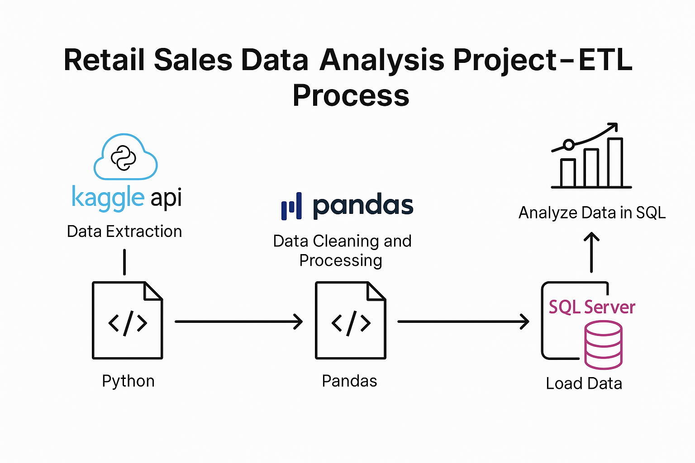

# Retail Sales Data Analysis Project – ETL & BI Pipeline

## Overview

This project uses the **Kaggle API** to download the **"Retail Sales Order Data"**. The data is then processed and cleaned using **Python** and **Pandas**, followed by loading it into a **SQL Server** for further analysis. The analysis addresses business questions related to sales performance, product trends, and profitability.

---

## Technologies & Tools Used

- **Data Extraction:** Kaggle API
- **Data Processing & Cleaning:** Python (Pandas)
- **Data Transformation & Loading:** Python (SQLAlchemy for loading data into SQL Server)
- **Data Analysis & Querying:** SQL (SQL Server Management Studio)

---

## Process

### 1. Data Extraction & Loading
- **Data Retrieval:** Used the Kaggle API to download the "Retail Sales Order Data".
- **File Extraction:** Extracted the dataset files using Python's `zipfile` module.
- **Data Loading:** Loaded the CSV file into a **Pandas DataFrame** for manipulation.

### 2. Data Cleaning & Preprocessing
- **Standardization:** Converted column names to lowercase and replaced spaces with underscores.
- **Handling Missing Data:** Managed missing values using methods like `fillna()` and `dropna()`.
- **Feature Engineering:** Created new columns like `discount`, `sale_price`, and `profit`.
- **Data Cleaning:** Removed irrelevant columns like `list_price`, `cost_price`, and `discount_percent`.

### 3. Data Transformation & Loading into SQL Server
- **Connection:** Established a connection to SQL Server using **SQLAlchemy**.
- **Loading Data:** Loaded the cleaned data into a SQL Server table `df_orders` for analysis.

### 4. Data Analysis (SQL)
- **Top Products:** Identified top-selling products based on total sales revenue using SQL queries.
- **Sales Growth:** Compared sales growth year-over-year and month-over-month.
- **Profit Analysis:** Analyzed profit growth between 2022 and 2023.

---

## Conclusion

This project demonstrates an **end-to-end data analytics pipeline** involving data extraction, cleaning, transformation, and analysis. It showcases skills in working with APIs, data manipulation using Python, and performing SQL-based analysis.

---

